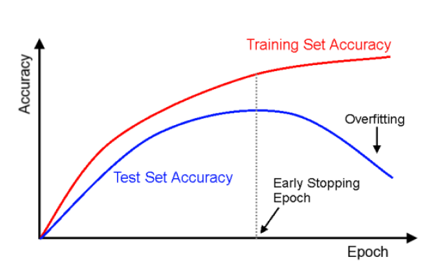

在一般應用情境中，我們希望建立一個能幫我們完成特定任務的模型。它的典型訓練步驟就是將資料分成訓練和測試，用訓練資料去給模型學習，再用測試資料來評估模型的效果。如果測試效果不好，但是訓練效果好，我會稱模型 overfitting 了。儘管模型它有好的訓練效果，但是不好的測試效果會使得無法實際解決任務，可以說它喪失了泛化能力(generalization)，只有記憶。本篇將描述如何使避免 overfiting ，而使得訓練及測試效果都很好。

<!-- more -->

## Early Stop
通常在訓練前，我們會把訓練資料再分出一小部份的資料當作驗證，這驗證資料除了主要是用來調整超參數的外，另一個用處就是計算訓練時每個epoch的效果。當我們觀察到訓練資料的效果與驗證資料的效果不一致時，訓練可以提早結束，所以些類方法稱 early stop。  

(TensorFlow 深度學習 龍龍老師)

## Lx Regularization
神經網路中常見的方法，其核心是增加模型的模糊性。最常見的是L0、L1和L2，並套用在損失函數如下。

$$
\min{\sum{L+\lambda R}}
$$

其中 L 為損失函數；R為正則化

$$
R_{L0}=\sum_{i}{\Vert w_i\Vert_0}\\
R_{L1}=\sum_{i}{\Vert w_i\Vert_1}\\
R_{L2}=\sum_{i}{\Vert w_i\Vert_2}
$$

其中$L0$定義為非零個數，由於不可微，神經網路較少使用。$L1$為取絕對值、$L2$為取平方。  
$L1$又稱Lasso Regularization，$L2$又稱Ridge Regularization。

## Dropout

出自於2012年 Hinton的\<Improving neural networks by preventing co-adaptation of feature detectors\>，即在訓練時，隨機關閉n比例的神經元，進行訓練。測試時則不使用。

## 資料擴增
此處的資料擴增並非尋找或蒐集新資料，而是在舊有的資料上做變化。影像常常可以透過此方式增加大量資料，但是影像之外的領域如沒有對於資料的分布資訊，較難擴充。