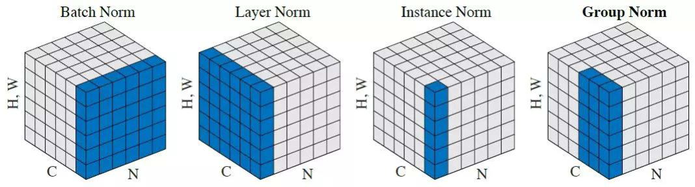

在神經網路中，我們通常會將輸入的X做標準化，來消除不同特徵間之尺度差所造成的影響不同問題。然而，在神經網路的隱藏層中，某層的輸出也有可能它們間的尺度不同，造成此問題。
<!-- more -->

以Sigmoid函數來說，它在輸入值為-2~2之間有較好的性質(導數不會接近零)，而沒有經過標準化的數值有可能會非常大、非常小，發生此類問題。

## Normalization
通常神經網路一次運算是一個Batch，所以又稱 BatchNormalization。  
針對每一層的$x$做以下處理：

$$
\hat{x}=\frac{x-\mu_r}{\sqrt{\sigma_r^2+\epsilon}}
$$

$\epsilon$為避免分母等於零，通常為$1e-8$。$\mu$則為$x$之平均值、$\sigma$為標準差。

上式在神經網路更新時並不會參與，所以作者引入了"scale and shift"，提供此分布的縮放，如下：

$$
\tilde{x}=\hat{x}\times\gamma+\beta
$$

其中$\gamma$和$\beta$由神經網路更新自動優化。

### Momentum
實作上Batch之$\mu$和$\sigma$會加入Momentum，整理如下。
$$
\mu_r\leftarrow momentum*\mu_r+(1-momentum)*\mu_B\\
\sigma_r^2\leftarrow momentum*\sigma_r^2+(1-momentum)*\sigma_B^2
$$
### 測試
在模型訓練好實際使用時，$\mu$和$\gamma$會直接使用訓練時期保存下來的值。

## 變種
Layer, Instance, Group Normalization.  

