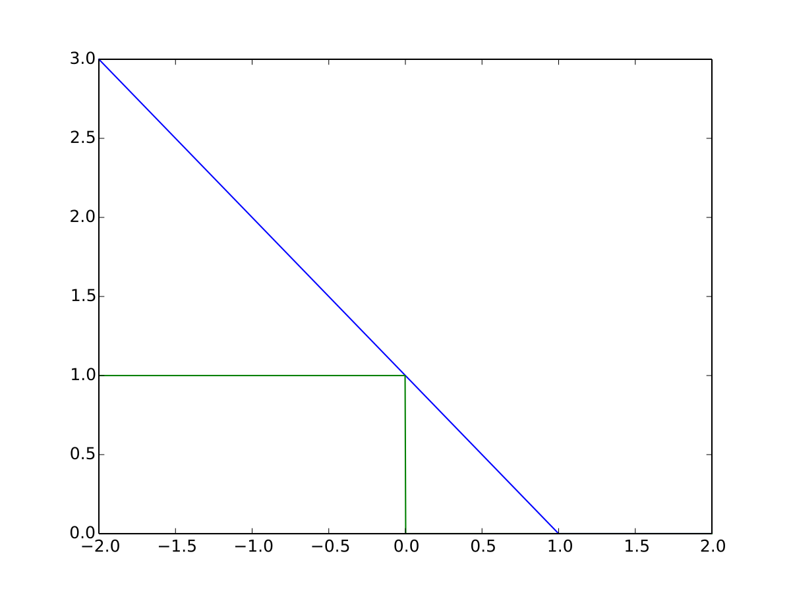

在神經網路中使用到的誤差函數常見的有MAE、MSE、CE，另有一些少見或特殊情況使用的函數將在本節收錄。
<!-- more -->

## Hinge Loss

$$
L(\hat{y})=max(0,1-y\hat{y})
$$

本誤差函式最早用於SVM，$\hat{y}$為模型預測值、$y$為答案($\pm1$)，由此函數顯示其不鼓勵模型預測超過$\pm1$如下：  
> 如果$y=1 \Rightarrow max(0,1-\hat{y})$，當$\hat{y}$小於1開始懲罰，大於1不懲罰=0  
> 如果$y=-1 \Rightarrow max(0,1+\hat{y})$，當$\hat{y}$大於-1開始懲罰，小於-1不懲罰=0  

其呈現出來有最大化界線之效果。